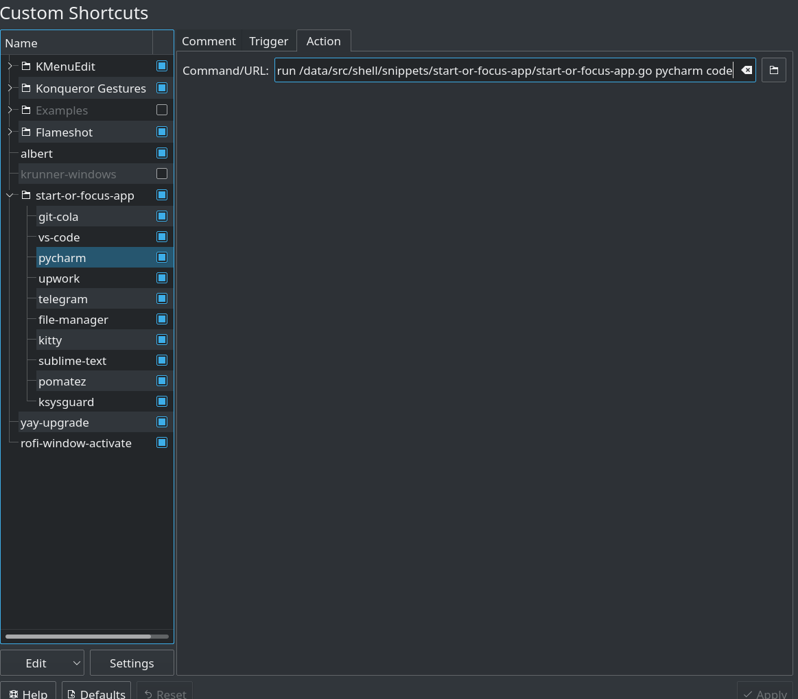

# start-or-focus-app
a small utility to set global shortcut keys for apps

# Usage

1. clone this repo
2. set a custom shortcut for each of the applications like shown here



   i. set a shortcur
   ii. the command needs to be

   ```bash
   ~/go/bin/gorun /src/shell/snippets/start-or-focus-app/start-or-focus-app.go pycharm code
   ```

   this will try to focus pycharm,vscode in order. If none of them are running, then starts pycharm.


# development

install gore and go-code with

```sh
go get github.com/motemen/gore/cmd/gore
go get github.com/mdempsky/gocode   # for code completion
```